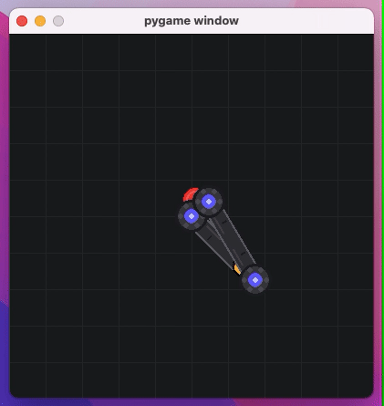

# 🤖 AI-Powered Robotic Arm Control 🦾

A reinforcement learning project where AI agents learn to control a robotic arm. 

Read the full story: **[Teaching Robots to Reach: A Reinforcement Learning Journey](https://syedfarrukhsaif.com/blog/training-a-robotic-arm-to-move-training-ai-in-a-custom-world)**.



## Overview

This project combines:
- 🏗️ Custom robotic arm environment built with **Gymnasium**
- 🧠 Deep reinforcement learning implemented via **Stable Baselines3**
- 🎮 Human-playable interface using **PyGame**

## Features

- 🏭 Custom 2D robotic arm environment with:
  - Joint motors
  - Dynamic target generation
- 🤖 PPO for precise control learning
- ✍️ **[Blog post](https://syedfarrukhsaif.com/blog)** documenting the entire journey

## Usage

**Manual control:**
```python
python robot_arm_env.py
```

**Train the agent:**
```python
python train.py
```

**Watch trained agent:**
```python
python use.py
```

## License

MIT License - See [LICENSE](LICENSE) for details.

## Acknowledgments

- Farama Foundation for [Gymnasium](https://gymnasium.farama.org/)
- [Stable Baselines3](https://stable-baselines3.readthedocs.io/en/master/) team for their RL implementations
- All the coffee that powered this project ☕
